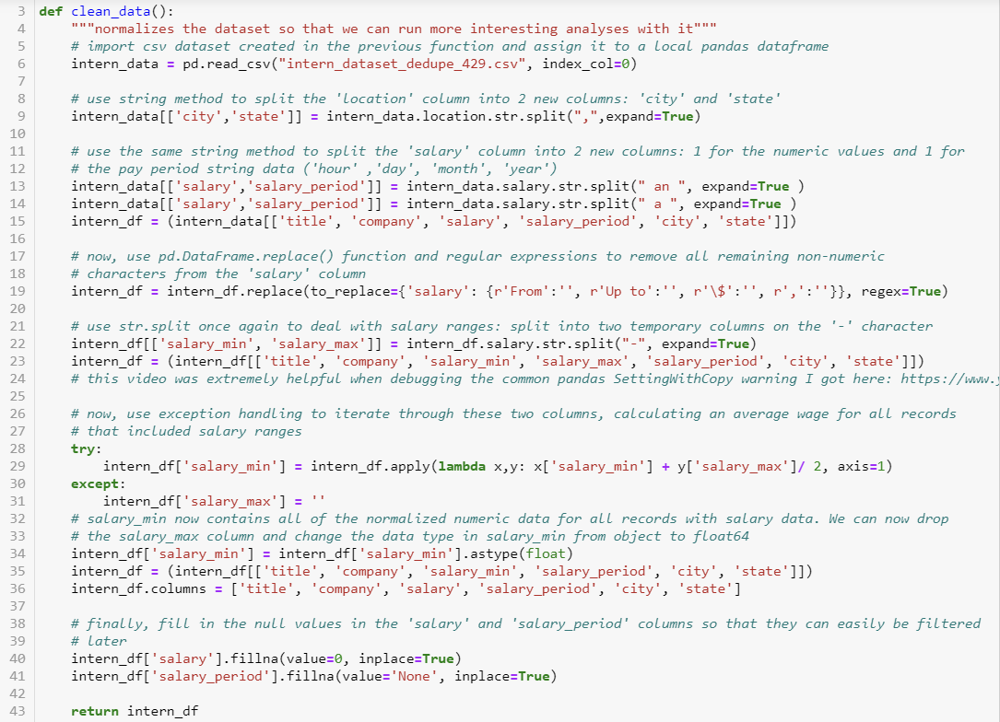
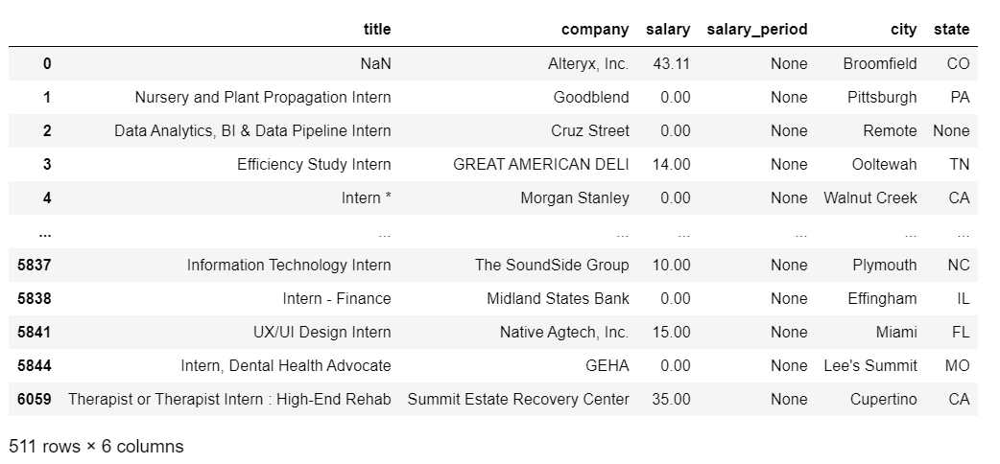
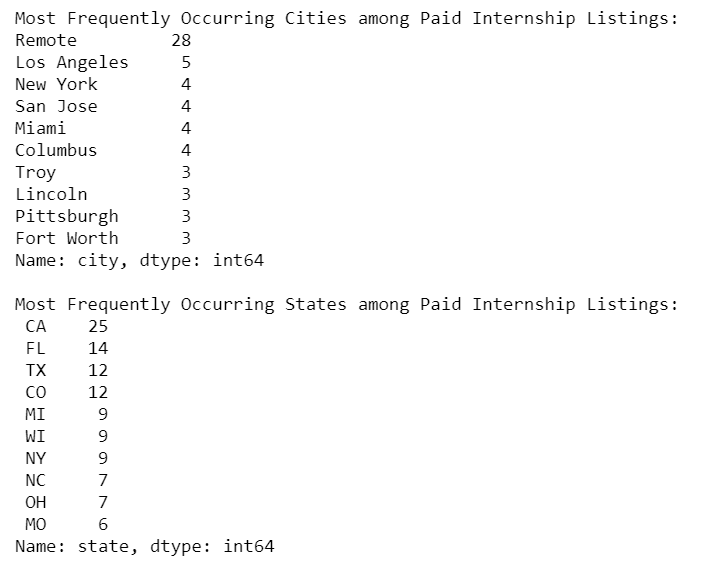

# internship_web_scraping_expanded
## Final Project for DAT-129 (Python II) - Analysis of Indeed.com data collected with BeautifulSoup

### Abstract

This program uses Python's `requests`, `pandas`, `csv`, `time`, and `BeautifulSoup` modules to scrape a simple search for U.S. internships on the popular job search engine, Indeed.com. The program exports this data to csv files, then imports them back into Python as a `pandas` dataframe in order to analyze current trends in internship compensation, geographic locations, and industries. 

### Purpose & Inquiry Question

For this project, I set out to look at a snapshot of internship listings (posted within the last week of April 2021) on the popular job search engine Indeed.com. I was interested in exploring the following questions:

* What percentage of internship opportunities currently listed on Indeed are paid positions?
* Among the paid internship opportunities on Indeed, what are the pay rates like?
* Geographically, where are paid internships concentrated?
* Are certain industries more likely to pay their interns than others?

I hypothesized (before reading the 2016 report from NACE) that only about 20% of internship postings would be paid opportunities, that most paid opportunities would offer around \$15 per hour, that paid opportunities would be concentrated in urban areas with high costs of living (NYC, the Bay Area, Chicago, and D.C), and that most of the paid opportunities would be in the fields of web development/engineering and finance. I backed away from the industry-related inquiry after realizing that, in this time of social distancing, it appears that the industries hiring interns right now are mostly ones where remote work is possible. For example, Indeed's Hiring Lab recently reported that [the percentage all marketing internships that offer remote work jumped from 14.3\% to 45.3\% during the pandemic](https://www.hiringlab.org/2021/04/27/remote-internships-jump-during-pandemic/).

### Background

Nearly ten years ago, Ross Perlin, author of *Intern Nation: How to Earn Nothing and Learn Little in the Brave New Economy*, estimated that U.S. employers hire for 1.5 million internships each year, and that approximately half of those internships are unpaid. More recently, in 2016, the National Association of Colleges and Employers (NACE) estimated that [around 60% of U.S. interns are paid, with most unpaid opportunities coming from social service fields](https://sites.sju.edu/careers/files/the-impact-of-unpaid-internships-on-career-development.pdf). NACE research on the topic of U.S. internships has also revealed that [college students who complete paid internships have far more favorable post-college employment outcomes than those who only complete unpaid internships](https://www.theatlantic.com/business/archive/2013/06/do-unpaid-internships-lead-to-jobs-not-for-college-students/276959/). In addition to offering interns less resume-building value than paid opportunities do, there are enduring concerns about the [equity](https://www.usnews.com/opinion/knowledge-bank/articles/2016-04-04/education-or-exploitation-should-all-internships-be-paid) and [legality](https://www.shrm.org/resourcesandtools/legal-and-compliance/employment-law/pages/is-your-unpaid-internship-program-legal.aspx) of unpaid internships. 

Despite all of this, unpaid internships still abound in the U.S. Meanwhile, young adults (ages 16-24) are facing unprecedented unemployment rates during the COVID-19 pandemic. The [Bureau of Labor Statistics reported the following update on youth unemployment in summer 2020](https://www.bls.gov/news.release/youth.nr0.htm):

> Typically, the number of unemployed young people increases between April and July, as people who were not in the labor force while attending school begin seeking 
> employment. However, this year unemployment increased sharply in April because of the coronavirus pandemic. The number of unemployed youth rose from 1.7 million in February > to 4.9 million in May, and declined to 4.0 million in July. In July 2020, there were 1.9 million more unemployed 16- to 24-year-olds than in July 2019. About two-thirds of > the unemployed youth in July 2020 were looking for full-time work, a similar percentage to a year earlier.

As of May 2021, the unemployment rate for this age bracket is still quite high at [11.1\%](https://www.statista.com/statistics/217448/seasonally-adjusted-monthly-youth-unemployment-rate-in-the-us/), nearly double the national average of 6.1\%. 

### Analysis Steps

#### Step 1) Getting the Data
The first step of this project was to use BeautifulSoup to collect the results of a search on Indeed.com for "intern" postings in the U.S. This step was extremely time consuming because 1) connecting with Indeed.com to run a web-scraping program tends to trigger captcha checkpoints that disrupt the program and 2) many postings on Indeed are reposted within a short timeframe, so there were *many* duplicate records in the original version of the dataset. 

To deal with the captcha roadblocks, I incorporated Python's `time` module to add a 2-second pause between iterations of the web scraping loop. In order to get enough unique records for analysis, I ran multiple calls of the `parse_web_data` function on multiple days in the last week of April. April was an ideal time to gather this data, since according to Indeed, this is the peak month for internship postings each calendar year (since most internships occur over the summer). 

My web scraping function ultimately exported the scraped data to a csv file so that the data can be quickly imported for analysis later and the web scraping function does not need to be run again. After exporting this data to multiple csv files, I imported them back into Python and combined them. 

#### Step 2) Cleaning and Normalizing the data
After running my web scraping function multiple times to get adequate data for this analysis, I used the pandas module to import the csv data files into pandas dataframes. The function below then concatenates all of the separate dataframes into one, and drops all duplicate records from the final dataframe. This left me with 511 unique records. Based on the total sample size of about 40,000 postings on Indeed.com during this timeframe, a sample size of 511 allows for a confidence level of 95% and a confidence interval of 5. Since so many of the 40,000 records seemed to be duplicates, the actual confidence level may be higher. 

#### Step 3) Analyzing the Data

Using pandas functions, I found that there are 222 internship records in the dataframe with salary information, about 43% of all records in the dataset, which is much higher than I originally hypothesized, but also much lower than the 60% reported by the National Association of Colleges and Employers in 2016. I then looked at counts and descriptive stats for paid internships by location and by salary period category (hourly, daily, weekly, monthly, and annually are all represented in the dataset!). 

### Conclusions

* Among 511 unique postings for internships featured on Indeed.com in the last week of April 2021, 43\% (222) were paid opportunities.
* Among the paid opportunities, more than half (67\%) offered an hourly wage ranging between \$10 and \$20. 
* About half of all remote-based internships posted to Indeed in this timeframe were paid opportunities. Additionally, about half of all internships in populous states like California, Texas, and Florida were paid. Remote-based positions were more likely to be paid than those based in any specific U.S. location. 
* Internships offering annual salaries had more variation in pay rate than those in any other salary period category, with a min of \$15,000, a max of \$65,000, and a standard deviation of \$11,578.  

### Limitations

* Around 45 records in the final dataset did not have job titles, so it is difficult to glean insights related to industry or skill level from these postings.
* While Indeed.com hosts tens of thousands of internship postings at any given time, there are other internship-specific search engines, like Handshake, which may be used by some employers instead of Indeed and that may prevent us from gaining a full picture of the current internship landscape from Indeed data alone. 
* Some industries may be underrepresented in this dataset as a result of the pandemic, during which many internship programs have been suspended (many involving work that cannot be accomplished on a remote basis). 

### Future Research

According to [a recent analytics report from Indeed](https://www.hiringlab.org/2021/04/27/remote-internships-jump-during-pandemic/), the rate of internship postings typically peaks in early April each year and slowly declines over the next few months. It would be interesting to scrape data over an earlier and longer timeframe in the spring to obtain a larger dataset for further analysis. It would also be interesting to compare which industries are represented among Indeed's internship postings right now compared to a year from now, when location-based internship programs may be reinvigorated. 
